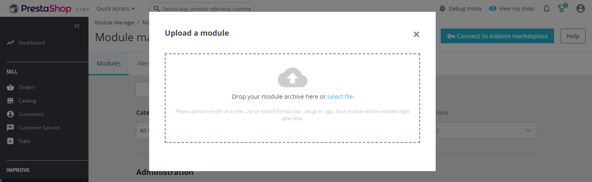
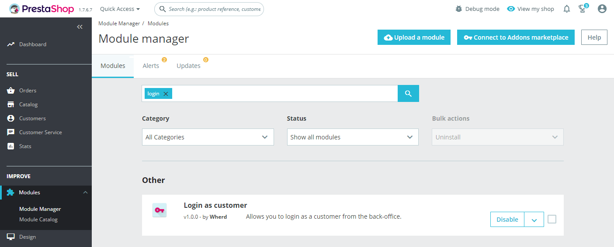
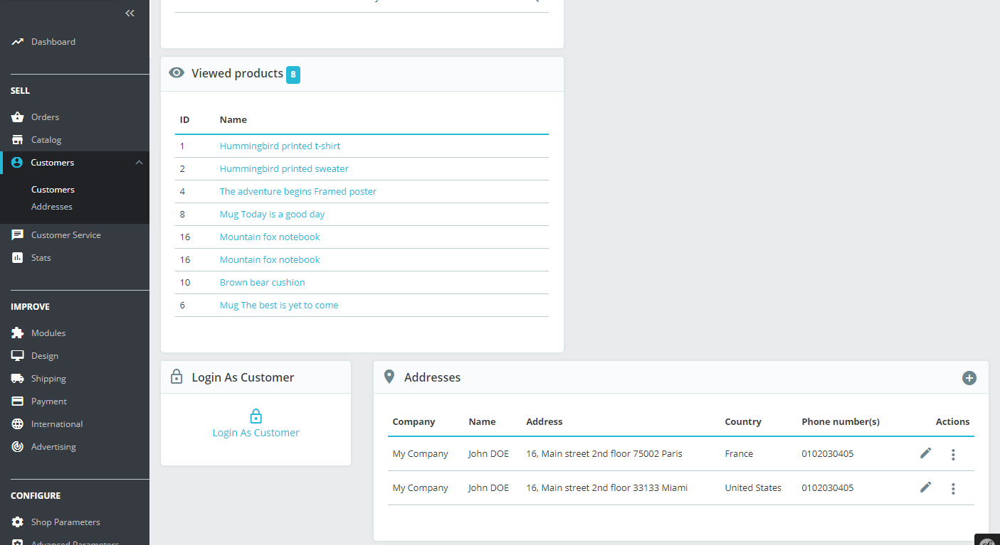
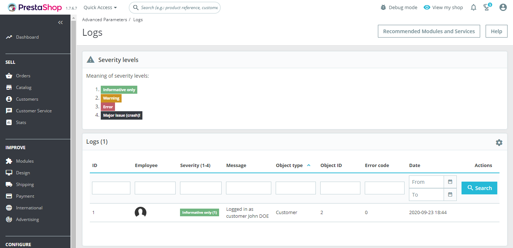

# Login as customer

_"Login as customer"_ module allows you to log in as a customer from your Back-Office. You can access the entire account of a customer.

__Version:__ 1.0.0\
__Prestashop compliancy:__ v1.7.0\
__Last update:__ September 20, 2020

+++

## Installation & Setup

After downloading the module installation _zip_ file, you need to upload it to the server.

The following is a series of screenshots that will graphically explain the process of configuring the module.

<small>Click on the "Upload a module" button and drop the downloaded installation file to the target area.</small>

<small>Enable the module if needed.</small>

<small>Log in as the customer and see what he sees without knowing the Customer password.</small>

<small>For security reasons and as a Super Admin, you can see which employees use this feature.</small>
